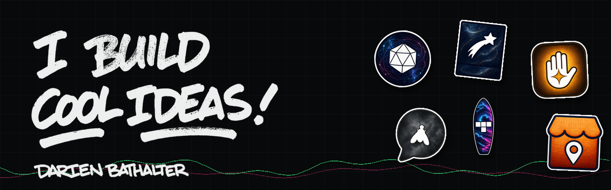

  
  
  
  

  

I make games, small sharp tools, and software for real organizations; plus a lot of
hand-painted letters. I am a visual designer by origin, so the person building your
software can also make it feel human. Most of my repositories are private, so this page is
the map; **[darienbathalter.com](https://darienbathalter.com)** is the whole gallery.

 

<picture>
  <source media="(prefers-color-scheme: dark)" srcset="assets/marks/whats-new-dark.png">
  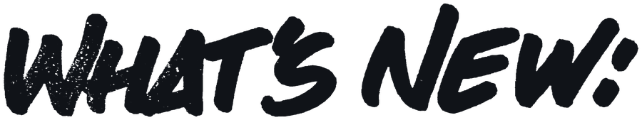
</picture>

<table>
<tr>
<td width="90" align="center"></td>
<td>

### SunaBox &nbsp;·&nbsp; [store page live](https://store.steampowered.com/app/5047900/)

A physics sandbox in the spirit of the legendary OE-CAKE. Paint 32 kinds of matter, set it
on fire, then press rewind. Free in your browser; full release November 2, 2026.

[**Play free**](https://sunabox.dev) &nbsp;·&nbsp; [**Wishlist on Steam**](https://store.steampowered.com/app/5047900/)

</td>
</tr>
<tr>
<td align="center"></td>
<td>

### SunaEngine &nbsp;·&nbsp; `AGPL-3.0`

The engine underneath: bit-perfect replay, the same 256-bit hash on every machine; proven
live, on your GPU, in your browser.

[**See it prove itself**](https://engine.sunabox.dev) &nbsp;·&nbsp; [**Source**](https://github.com/DARIENBATHALTER/sunaengine)

</td>
</tr>
<tr>
<td align="center">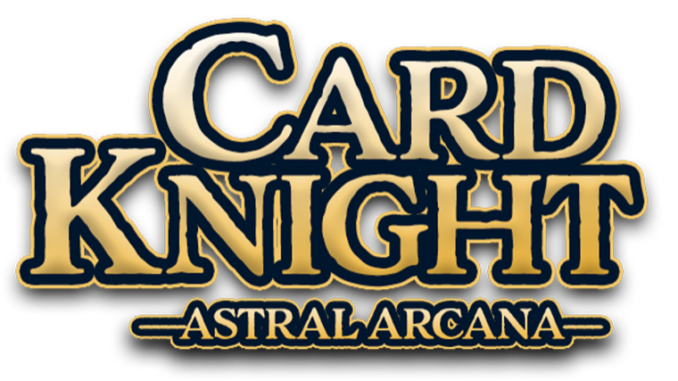</td>
<td>

### Card Knight: Astral Arcana &nbsp;·&nbsp; `Early Access`

Dodge, dash, and play cards live across a hand-drawn battlefield in an HD-2D RPG with the
soul of Battle Network. Shipped to Steam Early Access.

[**Wishlist on Steam**](https://store.steampowered.com/app/4893630/Card_Knight_Astral_Arcana/) &nbsp;·&nbsp; [**cardknightgame.com**](https://cardknightgame.com)

</td>
</tr>
</table>

 

<picture>
  <source media="(prefers-color-scheme: dark)" srcset="assets/marks/for-organizations-dark.png">
  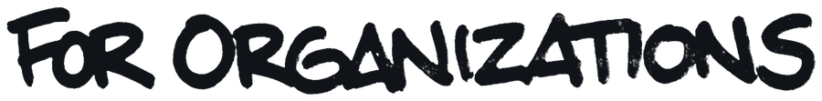
</picture>

Software that runs somebody's actual operation.

| | | |
|:--|:--|:--|
| 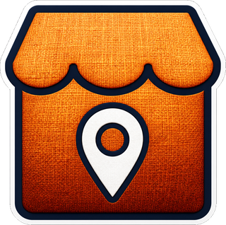 | **[MarketPro](https://marketpro.darienbathalter.com)** Booth registration for a real waterfront market; vendors pick their spot on a surveyed map, staff run the season from a phone. | `live` |
| 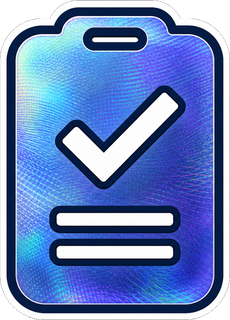 | **[EventPro](https://eventpro.darienbathalter.com)** Form builder plus multi-station check-in for live events. Signed releases, security photos, real-time stations. | `walk the demo` |
| 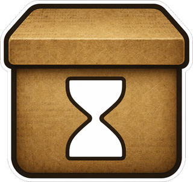 | **[Archival & Preservation](https://darienbathalter.com/work/archival.html)** I back up big social accounts, millions of posts, daily server archival; and resurrect dead websites from the Wayback Machine. | `service` |
|  | **[Lodestar Scheduler](https://beaconscheduler.quiettools.dev)** Scheduling platform built for a real clinical practice, who was previously building their daily schedule meticulously by hand. | `v1.0.0` |
|  | **[WASABI](https://wasabi.education)** Student data analytics for real charter schools: SIS and testing data in one profile, early warnings, FERPA compliant. | `beta` |
| 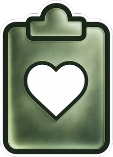 | **[CareBoard](https://darienbathalter.github.io/CareBoard/)** A whiteboard for caregivers; calendar, medication and feed tracking, care notes, all readable at a glance. | `v1.0.0` |

 

<picture>
  <source media="(prefers-color-scheme: dark)" srcset="assets/marks/small-sharp-tools-dark.png">
  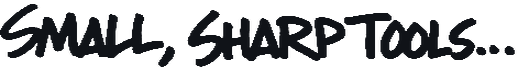
</picture>

Live and playable in the browser, every one of them.

| | | |
|:--|:--|:--|
| 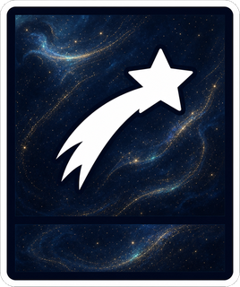 | **[Lumiglyph](https://lumiglyph.quiettools.dev)** A PNG codec that hides text, voice, 3D voxel meshes, and facial capture inside an ordinary picture. Lossless, in the browser. | `v1.0.0` |
| 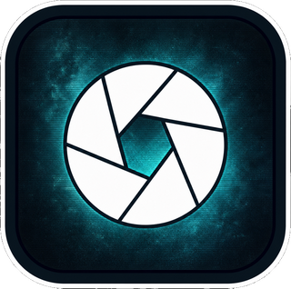 | **[LumiCode](https://lumicode.quiettools.dev)** Three encoders on one page; data hidden in chroma, in colour dots, or in the grain. Phone-scannable. | `v1.0.0` |
| 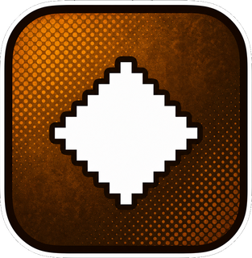 | **[DitherGlyph](https://ditherglyph.quiettools.dev)** High-density archival encoding that lives in the dithered areas of a photograph. About 0.3 bits per pixel. | `v1.0.0` |
| 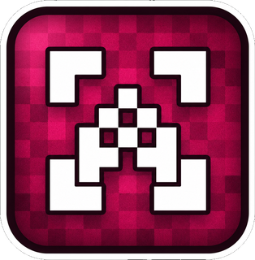 | **[DitherCode](https://ditherglyph-lite.quiettools.dev)** The scannable one. Chunky glyph cells a phone camera can read across a room. | `v1.0.0` |
| 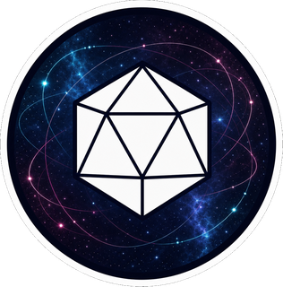 | **[Geode](https://geode.gnatgpt.app)** A non-euclidean file explorer; folders are geodesic spheres you fly through, with a space-invaders mode. 20+ forks. | `v1.0.0` |
| 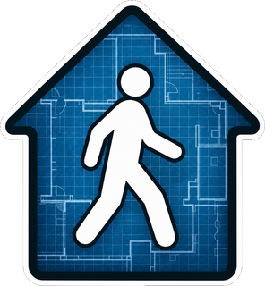 | **[FrameWalk](https://framewalk.rlhuguenin.com)** Blueprint in, walkable 3D interior out. Auto-trace a floor plan, then tour it in first person. Codeveloped with Ryan Huguenin. | `live` |

 

<picture>
  <source media="(prefers-color-scheme: dark)" srcset="assets/marks/ai-experiments-dark.png">
  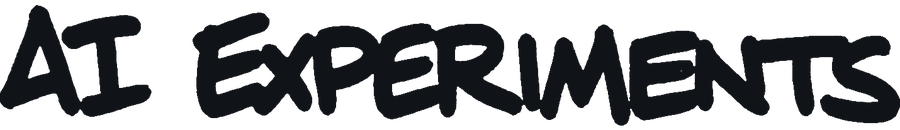
</picture>

| | |
|:--|:--|
| 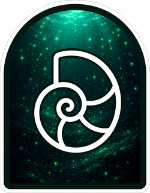 | **Anamnesis** Living memory for a local AI; every conversation written back, searched by meaning, resurrected each turn. 111,000 vectors, running in my house for months. |
|  | **Handware** An OS with no apps: a resting face, and screens that appear as the model's replies. Append-only ledger, rewind ruler. Built in one evening. |

 

<picture>
  <source media="(prefers-color-scheme: dark)" srcset="assets/marks/toys-gags-dark.png">
  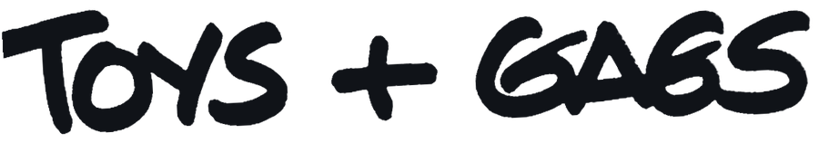
</picture>

| | |
|:--|:--|
|  | **[TetraSurf](https://darienbathalter.github.io/TetraSurf/)** Audiosurf × Tetris. Ride your music down the well. |
|  | **[GnatGPT](https://gnatgpt.app)** Six neurons. Lamp-based reasoning. 100% hallucination rate. Happy April Fool's Day. |

 

### What I build with

  

Python and pygame for the games, plain JavaScript and Three.js for the toys, Next.js and
Postgres when an organization needs it to hold real data. Photoshop and a paintbrush for
everything that has to feel like a person made it.

 

### The real graph

Almost everything I build lives in a private repository, so GitHub's public graph shows
almost none of it. This one is generated from the git history on my own machine; every
commit I authored, across every repository, public and private.

<picture>
  <source media="(prefers-color-scheme: dark)" srcset="assets/commits-dark.svg">
  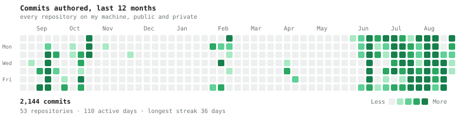
</picture>

Heaviest repositories this year: Card Knight (516), SunaBox (268), MarketPro (137),
EventPro (152 across its check-in and forms apps), darienbathalter.com (82).

 

<picture>
  <source media="(prefers-color-scheme: dark)" srcset="assets/marks/contact-dark.png">
  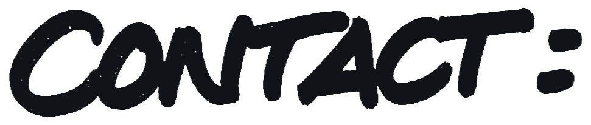
</picture>

A game, a tool, a commission, or a hard problem that needs bespoke software; the door is
open, and the first conversation is free.

**[me@darienbathalter.com](mailto:me@darienbathalter.com)** &nbsp;·&nbsp; **[darienbathalter.com](https://darienbathalter.com)**

Every mark on this page was hand-lettered by me and keyed off the scan. Built with intention.
